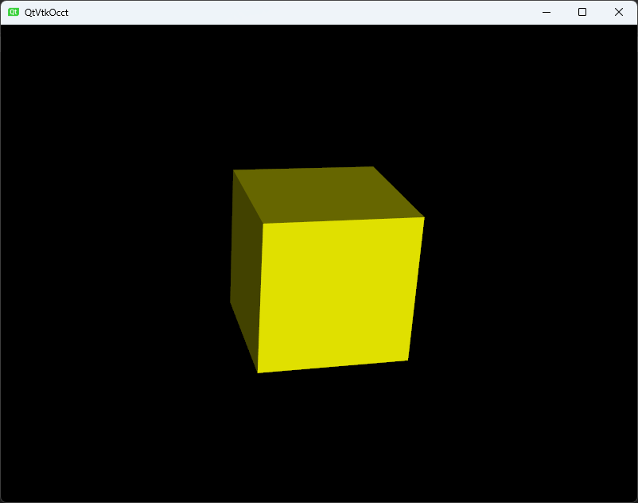

# FireCAD
This is a project for recording my studing experience of OCCT + VTK + QT


# Dependencies:

1、OCCT  (7.9.1)

2、VTK (9.5.0)

3、QT6 (6.9.1)

4、CMake  > 3.16

5、Visual Stdio 2022（with install Qt Visual Stdio Tool Extension）


# Build Dependencies: 

1.  use CMake GUI 
2.  build dependency 【OCCT + VTK】
3.  install dependency 【OCCT + VTK】


QT： Please using (python + aqt) to install QT

for example:

```C++
// install python(version >= 3.13)

// 1. pip install -U pip

// 2. pip install aqtinstall

// 
// 3. search arch if we want to install qt SDK 6.9.1 for windows 
// aqt list-qt windows desktop --arch 6.9.1 

//result: 
	win64_llvm_mingw 
    win64_mingw 
    win64_msvc2022_64 
    win64_msvc2022_arm64_cross_compiled

//we can choose the third: win64_msvc2022_64

// 4. install all subModules
	aqt install-qt windows desktop 6.9.1 win64_msvc2022_64 -m all

// 5. so the qt SDK has installed in this path:
//  C:\Windows\System32\6.9.1

// 6. add qt sdk bin to PATH, for example:
//  C:\Windows\System32\6.9.1\msvc2022_64\bin


```


# Build

- Set Dependency Library Find Path
  - method 1:  edit the Build.ps1
    - search this sentence:  \# you can edit these hard code to your own path
    - edit 3 variables:  user_occ_dir、user_vtk_dir、user_qt_dir
  - method2: set ENV variables  【don't forget reboot PC】
    - OCC_CMAKE_DIR
    - QT_CMAKE_DIR
    - VTK_CMAKE_DIR


run this power shell batch:  `./Build.ps1`

**Note:**  these path is point to the :   FindXXX.cmake  dir path  for search Library


# Run
cd build
open .sln  with  Visual Stdio 2022
run Project QtVtkOcct 


# Result


